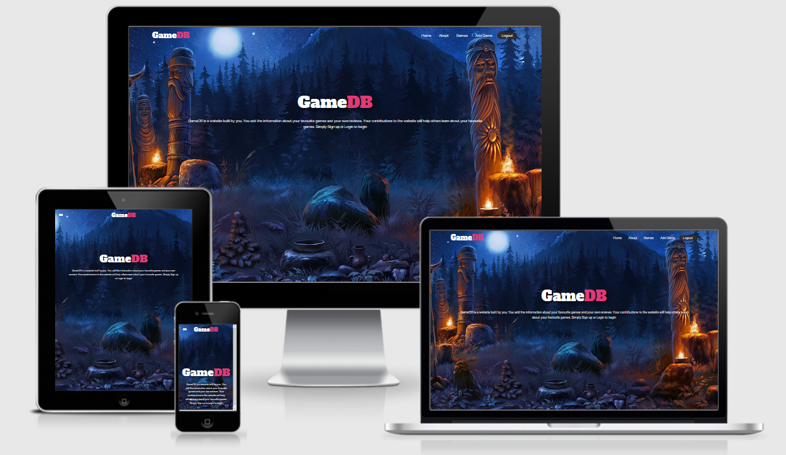

# Game-DB
#### Code Institute Data Centric development Project
 

  

 

<a href= 'http://gamersdb.herokuapp.com/home_page' target = "_blank">
GameDB</a>

 
## Table of Contents
 
- [**About**](#About)
- [**Demo**](#Demo)
- [**UX**](#UX)
    - [User Stories](#User-Stories)
  - [Research](#Research)
  - [Wireframes](#Wireframes)
  - [Design](#Design)
- [**Features**](#Features)
    - [Functionality](#Functionality)
    - [Existing features](#Existing-features)
    - [Future features](#Future-features)
- [**Technologies used**](#Technologies-used)
- [**Testing**](#Testing)
    - [Manual testing](#Testing)
    - [Errors](#Errors)
- [**Code Notes**](#Code-Notes)
- [**Deployment**](#Deployment)
- [**Credits**](#Deployment)
    - [Code](#Code)
     - [Images](#Images)
     - [Audio](#Audio)
- [**Acknowledgements**](#Acknowledgements)
- [**Disclaimer**](#Disclaimer)

## About
 
The purpose of this project was to build an open source multiple page site that allow users to create an account and add their own reviews
of their favourite games for others to view. The user adds the information about their favourite games and their own review. 
Their contributions to the website will help others learn about their favourite games. 
The site allows the user who uploaded the review to edit or delete it if they wish.
 
People really enjoy playing video games, and a resource like this to find reviews about games is great. 
 
 
## UX

### User Stories
 
* I want a website where i can go to find reviews about games before i buy them.
* I want a website where i can go to upload my own reviews about games i've played.
* I want the ability to be able to edit or delete a game review i've posted.
* I don't want other people to be able to edit or delete my reviews.
* I want the website to look apealing and have nice visuals and layout.
* I want the to be able to access the website both on my laptop/desktop and any of my mobile devices.
* I want to be able to to search games based on certain criteria.
 
### Research
 

### UI

* A responsive and sticky Navbar was essential.
* A search function was necessary for users to find games based on certain criteria.
* Forms to add and edit a game.
* A signup/login form.
* An about page which also tells the user how to use the website.
* A loading page was implemented due to alot of images being used on the website to stop poor impressions from unloaded images.
* A footer to provide some information and social links
 
### Design

* The design of this page is minimilistic but eye catching using 3 main colours, white, dark grey and pink.
* Each page has a nice image background, either full screen or partial.
* Links and buttons have a hover effect.
* Text containers have a background shadow to stand out from the page.
 
 
## Features

* Ability to Signup/login.
* Ability to add a game review.
* Ability to Edit a game.
* Ability to delete a game.
* A loading page.
* If a developer that doesn't exist in the database is entered with a new game the developer is added to the database for use when searching.
* If a game already exists in the database it won't allow a user to add it again.

### Functionality
 
* 
 
###  Future updates
 
-  **User Reviews** Ability to add reviews from multiple user to a game.
-  **Search** A more stable search function that allows blank criteria.
-  **Delete Confirmation** A fail safe Confirmation for delete button incase accidentally pressed.
 
## Technologies used

Below I have listed the programming languages, technologies, frameworks and resources used for this project.
 
* **HTML5**
* **CSS3**
* **Vanilla JS**
* **J Query**
* **Markdown**
* **Git** for version control.
* **Github** to hold my project.
* **Heroku** to deploy my project to the web.
* **Flask**
* **MongoDB**
* **[DaFont](https://www.dafont.com/)**
* **Google Chrome/FireFox/Edge/Safari** 
* **Developer tools for chrome/FireFox/Edge**
* **[Amiresponsive](http://ami.responsivedesign.is/)**
* **[Balsamiq](https://balsamiq.com/)** to create wireframes.
* **[W3Schools](https://www.w3schools.com/)** for help with some issues i ran into
* **[StackOverFlow](https://stackoverflow.com/)** for help with some issues i ran into
* **Mentor** my code institute mentor for advice
* **[Slack](https://slack.com/)** specifically the code institute room in slack.
* **[Grammarly](https://www.grammarly.com/)** to correct grammar and spelling mistakes.
 
## Testing

* [HTML validator](https://validator.w3.org/#validate_by_input)
* [CSS validator](https://jigsaw.w3.org/css-validator/#validate_by_input)
* [JsHint](https://jshint.com)
* Testing [checklist](https://geteasyqa.com/qa/test-website/)
 
 
I personally tested the website on some of my own personal systems of which include:
 
* MSI gaming laptop running windows 10 
* Acer aspire windows 7 laptop
* HP Windows Vista desktop
* Custom built windows 7 high-end Gaming Desktop
* Samsung galaxy s5/s6/s7/s9/s20 (Android) phones
* Samsung Galaxy Tab A6 Tablet (Android).
 
The website from my testing is compatible on multiple browsers.

I had family and friends test the website also.
 
### Manual testing

* Create an account, works as it should, passwords are hashed for security. &#9745;
* Logging in to created account, works as it should. &#9745;
* Add game using form, works as it should. Adding a game is only possible when logged in. &#9745;
* Game is displayed on games page, works well. &#9745;
* Game info is displayed on seperate page when clicked into. Works as it should. &#9745;
* Edit game, works as it should, only editable by the user that submitted it. &#9745;
* Delete game, works as it should, only able to delete if you submitted the review. &#9745;
* Add game button on visible in nav if user is logged in. &#9745;
* Edit/Delete game buttons on visible if you are the user who entered the review. &#9745;
* Login and Singup buttons only visible if you are not signed in. &#9745;
* If username already exists in database, prompts user that it already exists. &#9745;
* If user enters login url when already logged in it will redirect to home with flash message. &#9745;
* Search function, not 100%, returns 505 if no criteria specified(caught with custom 505) &#9745;
* All links work. &#9745;
* Game can only be entered once on database. (checks title) &#9745;
* Developer being added to seperate collection when user submits game review if it doesn't alread exist in database. works &#9745;
* Flash messages appear when appropriate to ensure completed action to user, or if errors occur. &#9745;
* All fields required when adding/editing games so no fields are empty on game description page. &#9745;
* Correct data is displayed for each field in edit form. &#9745;
* Automatically converts youtube videos to embeded to display video in iframe. &#9745;
* Custom 505 error page. &#9745;
 
No automated testing was conducted.
 
### Errors

Current errors:
 
1. ***NOT YET FIXED*** No required field pop up when select field is left empty on add/edit game form.
2. ~~***NOT YET FIXED***  issue with static directory, images have to be in static/css -- fixed, file structure error.~~
3. ~~***NOT YET FIXED***  can't read js from file has to be on page -- fixed, file structure issue.~~
4. ***NOT YET FIXED***  video/image buttons not disapearing when video iframe is clicked.
5. ***NOT YET FIXED***  search doesn't work -- partilaly fixed, figured out on own by importing from bson.json_util import dumps and testing query results by #return dumps(query)
    #return dumps(mongo.db.games.find({'genre_name': 'Adventure'})).
    search not complete, needs to fash a message when result is empty (done &#9745;) and ignore null fields if some fields are left empty
6. ~~***NOT YET FIXED*** iframe expects embed url, can't rely on user to enter embeded url  -- fixed by adding embed trailer function.~~
7. ~~***NOT YET FIXED*** page overspilling - fixed, crumbs container width.~~
8. ~~***NOT YET FIXED*** date picker colour -- fixed with css.~~
9.   ***NOT YET FIXED*** no visual for users that aren't logged in that its possible to edit/delete a game -- fixed by adding if block that redirects to login if not logged in.(redundent since it was changed to user only)
10. ~~***NOT YET FIXED*** forgot to changed mobile nav based on user logged in.~~
11. ~~***NOT YET FIXED*** home/login/signup pages don't respond well on large screens - fixed by changing css properties.~~
12. ~~***NOT YET FIXED*** forgot to changed mobile nav based on user logged in.~~
13. ~~***NOT YET FIXED*** card title pushes up card image if its too long -- fixed by adding set height to card.~~
14. ~~***NOT YET FIXED*** had to use document.body.load for preloader javascript due to firefox support.~~
15. ~~***NOT YET FIXED*** error with if logic in insert_game route when checking if developer already exists --- fixed.~~
16. ***NOT YET FIXED*** no way of recovering an account.
17. ~~***NOT YET FIXED*** Body tags in templates other than base to have full size body tags, created an if block in base to assign body tags for each page instead.~~

## Code Notes

 Some warnings/errors occuring with linter which i can't stop from being flagged.

## Deployment

To deploy this project I used [Heroku](https://dashboard.heroku.com/)
 
### How to deploy code locally:

paste this into your console:
 
git clone https://github.com/aidant842/MilestoneProject3.git
 
## Credits
### Code

* Some tutorial videos on flask i watched from pretty printed [here](https://www.youtube.com/channel/UC-QDfvrRIDB6F0bIO4I4HkQ)
* Custom loader tutorial video [here](https://www.youtube.com/watch?v=xuA83OYTE7I&t=106s)
* I found a template for this README in one of the channels in slack, however i can no longer remember where it was to credit the user who posted it.

### Images

* All background images came from [Google-Images](https://www.google.com/imghp?hl=en)
 

## Acknowledgements
 
A thank you to my friends and family for testing the game for me.
Also a thank you to my mentor for the help and support.
 
[Back to top ↑](#Snake-Game)